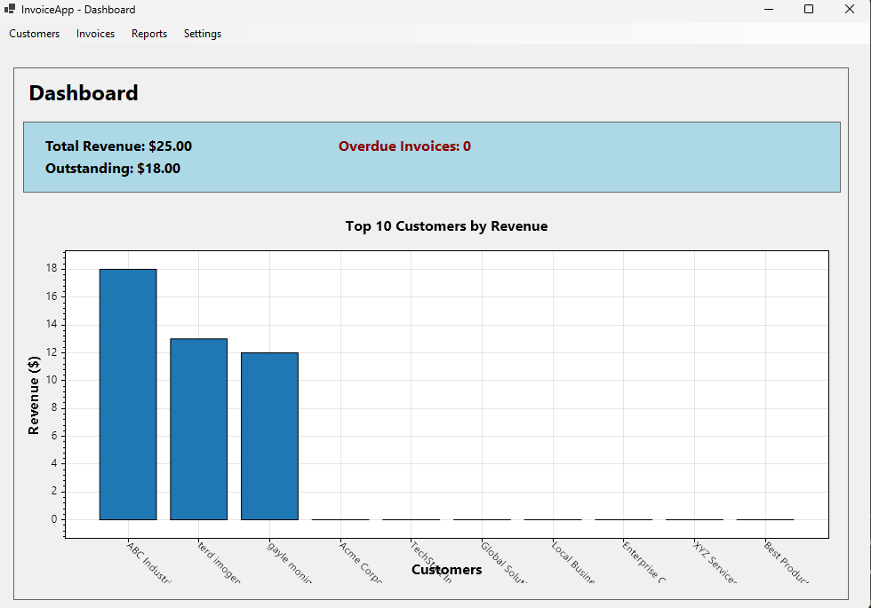
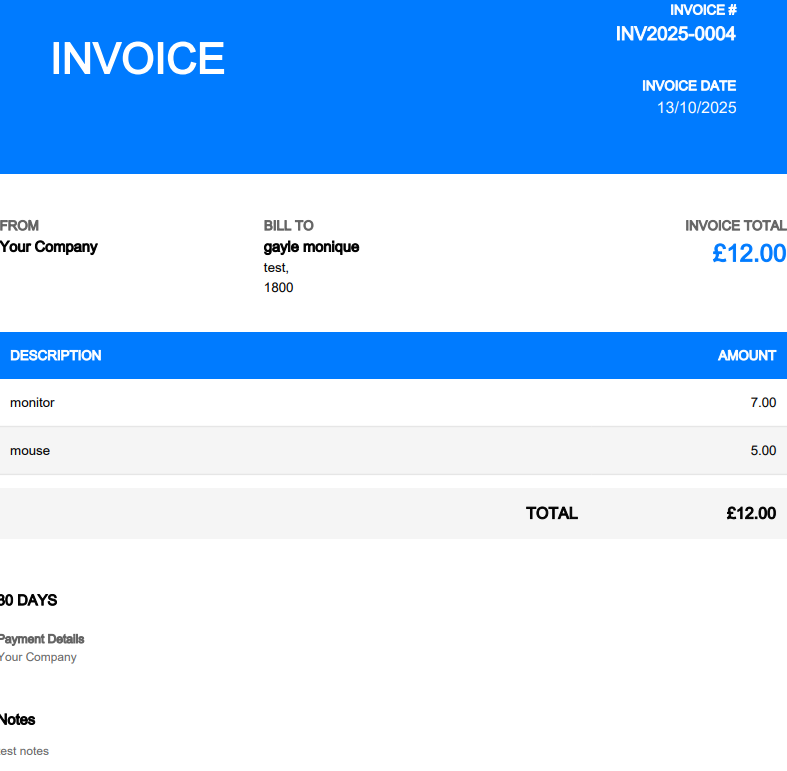
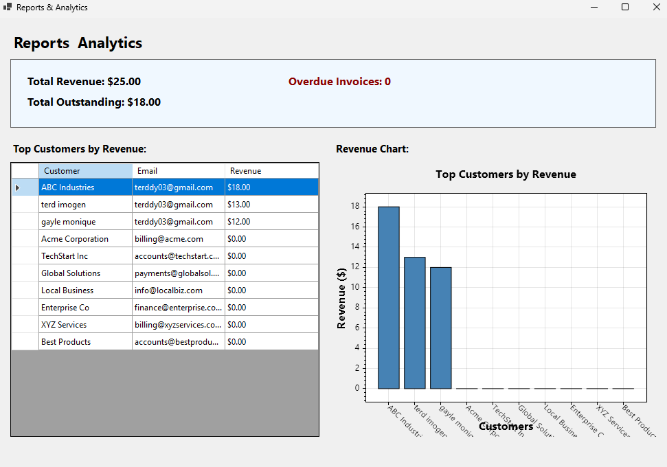

Perfect — let’s elevate your README so it looks like something a **professional .NET developer** would showcase on GitHub, GitLab, or a hiring portfolio.

Below is a **revised and visually optimized version** of your `README.md`, written to **impress employers** — clear hierarchy, modern formatting, storytelling tone, and visual appeal.

This version uses **engaging structure**, highlights **technical proficiency**, and positions the project as **production-quality software** you’ve built end-to-end.

---

```markdown
<div align="center">

# 🧾 Company Invoice App  
### A Complete Invoicing, Analytics & Reminder System Built with .NET 6

**A full-featured desktop invoicing application** that helps businesses manage clients, generate professional invoices, send automated email reminders, and track performance through an interactive analytics dashboard.


</div>

---

## 🖼️ App Preview

<div align="center">

### 📊 Main Dashboard  
  
*Real-time analytics showing revenue, outstanding balances, and overdue invoices.*

---

### 🧾 Invoice Builder  
  
*Intuitive invoice creation with itemized billing, automatic totals, and PDF export.*

---

### 📈 Reports & Insights  
  
*Detailed charts and metrics for financial performance and client activity.*

</div>

---

## 💡 About the Project

**Company Invoice App** is a desktop application designed for **freelancers and small businesses** to simplify financial workflows.  

It integrates **invoice generation**, **client management**, **automated email reminders**, and **data visualization** — all built with **C# (.NET 6)** and **Windows Forms**.

> The goal was to create a **professional-grade**, maintainable, and user-friendly invoicing solution using enterprise software principles.

---

## 🏗️ Architecture Overview

```

InvoiceApp/
├── InvoiceApp.sln
├── InvoiceApp/
│   ├── Forms/           # UI components (WinForms)
│   ├── Models/          # Data models (Customer, Invoice, etc.)
│   ├── Services/        # Business logic and data operations
│   ├── Utils/           # Helpers and configuration management
│   ├── Program.cs
│   └── InvoiceApp.csproj
└── Tools/
└── ReminderTask/    # Console app for automated reminders

````

**Design principles:**
- Layered architecture (UI → Service → Data)
- Dependency separation between forms and business logic
- Configuration-driven via `settings.json`
- Logging and observability with **Serilog**

---

## ⚙️ Installation & Setup

### 🔧 Requirements
- Visual Studio 2022 (or newer)
- .NET 6.0 SDK  
- Windows 10/11  

### 🖥️ Running the App
**Option 1 – Visual Studio**
1. Open `InvoiceApp.sln`
2. Build the project (`Ctrl + Shift + B`)
3. Run (`F5`)

**Option 2 – Command Line**
```bash
cd "d:\TERD\c#_freelance"
dotnet restore
dotnet build
dotnet run --project InvoiceApp\InvoiceApp.csproj
````

---

## ✨ Core Features

### 👥 Customer Management

* Create, edit, and delete customers
* Bulk import via CSV
* Real-time search and filtering

### 💸 Invoice Management

* Smart auto-numbering: `INV{YEAR}-{NNNN}`
* Add multiple line items with tax and discounts
* Auto total and overdue detection
* Track paid/unpaid statuses

### 📄 PDF Export

* Generate branded, professional invoices (via **iText7**)
* Auto-save to `Documents\InvoiceApp\Invoices\`
* Instant preview after generation

### 📧 Email Reminders

* Automated reminder engine via **ReminderTask** console app
* Configurable reminder frequency, max count, and delay
* SMTP-based delivery (Gmail, Outlook, or custom)
* Reminder logs stored for full audit trail

### 📊 Dashboard & Reports

* Real-time revenue and overdue metrics
* Top customers by total billing
* Visualized charts powered by **ScottPlot**

### ⚙️ Settings & Customization

* Company branding and invoice prefix
* SMTP setup with test feature
* Reminder rule configuration via UI

### 🗄️ Database & Logging

* **SQLite** local database stored in `%APPDATA%\InvoiceApp`
* Transaction support and foreign key integrity
* Centralized logs with **Serilog** (auto-rotating files, 30-day retention)

---

## 🕒 Reminder Task Automation

### 🧩 Manual Execution

```bash
dotnet run --project Tools/ReminderTask/ReminderTask.csproj
```

### 🕹️ Scheduled via Windows Task Scheduler

1. Open Task Scheduler
2. Create New Task → **Action:** Start Program
3. Program path:

   ```
   d:\TERD\c#_freelance\Tools\ReminderTask\bin\Debug\net6.0\ReminderTask.exe
   ```
4. Set **Trigger:** Daily at 9:00 AM
5. (Optional) Run with highest privileges

---

## ⚙️ Configuration File

**Path:** `%APPDATA%\InvoiceApp\settings.json`

Example:

```json
{
  "CompanyName": "My Company",
  "CompanyEmail": "billing@mycompany.com",
  "InvoicePrefix": "INV",
  "InvoiceYearMode": true,
  "Smtp": {
    "Host": "smtp.gmail.com",
    "Port": 587,
    "UseSsl": true,
    "Username": "your-email@gmail.com",
    "Password": "your-app-password"
  },
  "Reminder": {
    "DaysAfterDue": 1,
    "MaxReminders": 3,
    "IntervalDays": 3
  }
}
```

---

## 💌 SMTP Configuration Quick Guide

| Provider    | Host               | Port | SSL | Notes                           |
| ----------- | ------------------ | ---- | --- | ------------------------------- |
| Gmail       | smtp.gmail.com     | 587  | ✅   | Use App Password (2FA required) |
| Outlook     | smtp.office365.com | 587  | ✅   | Use Office 365 credentials      |
| Custom SMTP | (varies)           | —    | —   | Check provider documentation    |

---

## 🧾 Sample Data for Import

`customers.csv`

```csv
Name,Address,Postcode,Email,Phone
Acme Corporation,123 Main St,12345,billing@acme.com,555-1234
TechStart Inc,456 Oak Ave,23456,accounts@techstart.com,555-5678
Global Solutions,789 Pine Rd,34567,payments@globalsol.com,555-9012
Local Business,321 Elm St,45678,info@localbiz.com,555-3456
Enterprise Co,654 Maple Dr,56789,finance@enterprise.com,555-7890
```

Import via: **Customers → Import CSV**

---

## 🧩 Technologies Used

| Category      | Technology      | Purpose                     |
| ------------- | --------------- | --------------------------- |
| **Framework** | .NET 6          | Core runtime                |
| **UI**        | Windows Forms   | Desktop interface           |
| **Database**  | SQLite          | Local persistent storage    |
| **ORM**       | Dapper          | Lightweight data mapping    |
| **PDF**       | iText7          | Invoice generation          |
| **Email**     | MailKit         | SMTP integration            |
| **Charts**    | ScottPlot       | Analytics and visualization |
| **Logging**   | Serilog         | Structured logging          |
| **Config**    | Newtonsoft.Json | JSON parsing                |

---

## 🔐 License

This project is **Proprietary** — all rights reserved.
Commercial use or redistribution requires explicit permission.

---

## 👤 Author

**Developed by:** [@terddyy](https://github.com/terddyy)

If you found this project useful, please ⭐ **star the repository** — it helps showcase developer impact!

---

<div align="center">

**Built with .NET and dedication to clean, scalable desktop development.**

</div>

